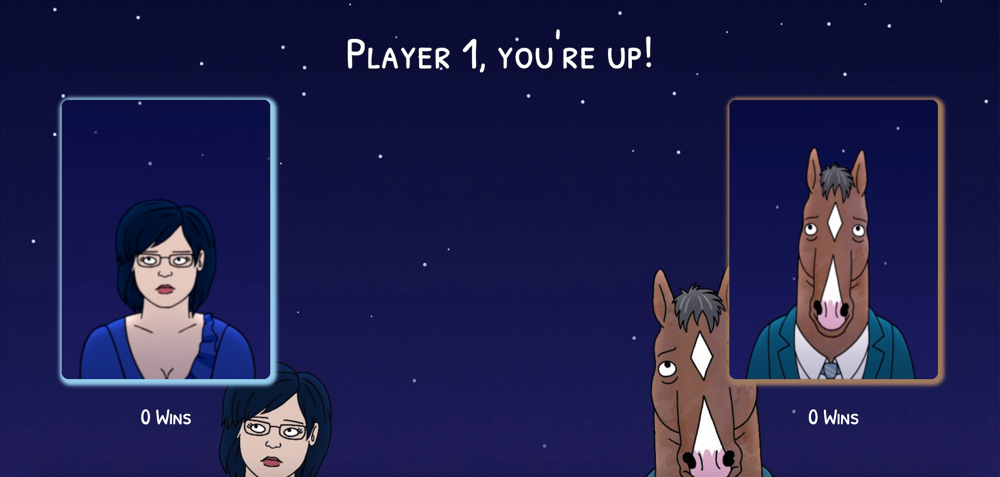

# Slapjack

## Introduction

_SlapJack!_ is a fun card game for kids and adults of all ages! All you'll need to get started are __two players__ and a __computer keyboard__.

### _Let's go!_

## Rules:
Each player alternates dealing a single card to a center pile.  That pile can be collected by _slapping_ said pile in one of the three acceptable scenarios:
  + _SlapJack_ - A jack appears on the top of the center pile.
  + _Double_ - Two cards of the same value appear back-to-back.
  + _Sandwich_ - Two cards of the same value are split by a single card of a different value.
  + _Wild_ - A wild card may be used to satisfy any of the three scenarios above.

  _If a player mistakenly slaps the pile outside of these four scenarios, they must grant a card to their opponent_

The point of the game is to collect all the cards in the deck. If a player is out of cards,  _SlapJack_ becomes the only "slappable" scenario.  If the player without cards slaps first, they collect the pile and re-enter the game. However, if that player isn't quick enough or they slap on a scenario other than _SlapJack_, the other player wins!

## How to play:

__Controls:__

 __Player 1: press _'q'_ to deal or _'f'_ to slap__

 __Player 2: press _'p'_ to deal or  _'j'_ to slap__

1. On the opening page, you'll find two hands for each player. Player 1 is on the user's left highlighted in blue and Player 2 is on the right highlighted in brown.  

  To get started, _click the center button to deal the cards to each player evenly_.
  

2. Player 1 goes first.  Alternating turns, players will deal their top card to the center pile using their keyboard controls.  
  

3. As the two players cycle through their decks, the center card will be highlighted the same color as the player who played it.
  

4. When one of the four scenarios appears, think fast: it's time to _slap_!
  

5. Oh no! It looks like Player 2 is out of cards.
  

6. Remember: only a _SlapJack_ can win the game for Player 1 or keep Player 2 alive.
  

7. Player 1 was just a little two fast this time!  Don't fret, Player 2 - the game resets automatically so you can play again!
  

_*Deployed set is not available at this time_

## Goals
+ Demonstrate growth with structuring and styling websites using HTML and CSS.
+ Develop and practice adhering to DRY and SRP code standards.
+ Strengthen critical thinking skills.
+ Practice utilizing localStorage to retain and retreive data.

## Technologies
+ HTML
+ CSS
+ JavaScript

## Code Architecture
 AppleWebKit/537.36 (KHTML, like Gecko) Chrome/87.0.4280.141 Safari/537.36" etag="FliDQevvUGglEBxBxiD5" version="14.2.5" type="google"><diagram id="hGrxYckwlaAGopMwLM2H" name="Page-1">7Vtdd5s4EP01PvsUH8SneWyctE23283WOdvt0x7FKDZbIfkIObb76ysJgQGR2KnNR7t9SdAgMNwZje5ciZEzTbZvGFwt/6ARwiPbirYj52pk28C1ffFPWnaZJQhAZliwONKd9oZZ/BVpo6Wt6zhCaaUjpxTzeFU1zikhaM4rNsgY3VS7PVBc/dUVXCDDMJtDbFo/xRFfZtaJZ+3tb1G8WOa/DCx9JoF5Z21IlzCim5LJuR45U0Ypz46S7RRhCV6OS3bd6yfOFg/GEOHHXPDq6034Dm3f332Y/fWes7vX8ca7AJb2zyPEa/3K+nH5LscARQIS3SSUiH+XjK5JhOSdLdGijC/pghKI31O6EkYgjP8hznfaoXDNqTAteYL12exH5J2ffB1tSumazdGz76DjArIF4s90dCYF7CJeEU0QZztxIUMY8vix+iRQB86i6LfHVhxoeF8EtYH0tTyGHAnrDMOVATxb0uR+LR7kcrOMOZqtoAJiI4ZaE5qPiHG0fR5P8+31BaF+PD1OiwG42Ud9EdvLUsTn150dLzs8HJkpZ/RLMTDtKihiwK1kv2S7kLlp/IDpZr6EjI8hIZQLl1Pyr7wG4nhBREeMHsRLXWJ4j/AtTWPZQZhZ9rKXKxoTjtj1o0A01b/B9H1EM7TO4wgAvIonvNAzPOE1OKLwztk94QSGJz5Q0b5QY2eFIDcjt8gPoJPo9arR6/smZpMGzNzWIJsYkL2D8y8jW9zOuqLrewGUOp5BEm3i+TJrfYrl9PS6dzjDagg6tgln2ACn3xqcv3JB5gjPdITbaS5wgQF8G/QAbWP+j7x87OnWZ30zeXy1LTd2unEspTiBAOhLb6X3S14KqtnHdbzqLTIKo68qU7SX3iijOMaNlCeL9zmBojhON94l4jlL7pXNz+Vzewer1ks9fARpdPWbHiSNIOMhpwbNK8bgrtRBJZD06ZgKnGooBDoF7z2e3fGs/s9BKaXZWwx3iMn0Ip5clFmQRanyhEhBRFoWMEHj3icsD9TgssxECewuGYDrPk2aboiwiqsFZIL2C/SsAubNkqpqNkliGR5WXOkq8RYhJ0+IeSZzh6qI5R/xWvIOdLUSw5T0z8lAjZS5DSyi25Ii1x5+FBpxcT4eUXNF7zVFYBuu+Kzi+iIzHjc69JhIVGqdU4ylBKSGgmwjia3EKcYyRfkwkUFO7tNVgWqPw8Me3Oh4SfZP1qlE+gtC0gEREh4ji/7nAacmY3hhMPbcI6cCe+z6LWE7MWW262TFdwpaEqlEL18Uyym9//pvUkOxoZxuhLC1AnBiShCqnh4AVqAGlu+YYPldMo/QZB771JrpjNZUEYc6ch3KjXW90ffEQDVwa9JsgtZw8wxEuitt8zOnlbZHFD75SDpY+GQd+1LLQ79TZ4CSK/aO+eUM7Qwz+xre6Z03nyMpubWklPOvAzQ59NoC3pSRf0rgnZrw1aTfgyah02sLeZDrLz/wwmgYHpldTte4TotyU90vCo+IKuoiYlVR5UdZ2MFRVfmQrFmWiX8WyocSpwZYjRyrSrXGo4uKskmWGgw3NMoPMw13ygyBZaoVP2ce9mvIu2bAOl1OgMB6RpSI4oj8VsoLSp6QiWCaKUEycUjtJ1tbZShdJ2i4krXfgHXnOgWwTKo3pUTE9lopa3KSK+lxcwzTdHDKmldfO2moLLtOu+YUZ8L6RsTlcEEdHKYNG6qGl5Rb2BQQgLFd3RbQkDm6VfMB6GRlBZi+6GojxsQZB7V9WU1DIHdMV7CbUt//Ygh4TgH+cIaA93MPAb82Awwi/s1llRsxq0LCY8gV17MLupL2PoXWCB8Ax0rerS0ViEcwAHxLcSSRu0L5fsVpvpB6q8h03ygOEUZTp5st1w8PWMag2vKJIN6voGrdYihxaTvfi6hvj1ur/OwjtM+BC3Cg+GTloAJnNXuoo08TbJO+DUYMqgWnqDKaSo+mnRKT9mLzGD1IT+fiVcVshD+iuZiXFvLsIdTuKec00RGsmZU6fogxnlJMWTnczz7RO7VNx6BhQTsoMkQF8KDFdBB0MvqL1dl+FgSBffy+1FM3M5/oD1OYk5NckTLEePSxpKf3gjn4C3mkJr0DZKLDzOLUCK1tTYoa7+AmrPbi3CzpckZ2c5WRiQ9KJ8q+FyGaYLxVu4h6JhJu8L1EwmuTSJiF2e9EfhhqW3drRjL89mtHGleignQmsuu6f4bmDRNYs/rKeW7TUFefOwlWoSP2b7nJM6vSekbXDwfJf03J+CNKkZSLM6G4htoBnKqgngO1Wky2ubgpmvsPpbOvHfafmzvX3wA=</diagram></mxfile>)

## Challenges and Triumphs
+ With this being the most logically complex project to date, it wasn't long before the codebase became entangled in a way that yielded undesired outcomes (i.e. winning the game on a sandwich or the notification didn't match the action, etc.).  To fix this, I separated some of my methods more to carry out even more specific actions so as to not contaminate other data references. Encountering this challenge taught me that SRP is not only important for the sake of developer empathy and reading code, but also for overall functionality of the application.

## Local install instructions
+ Clone this repo
+ CD into the intention-timer directory
+ Open index.html in your browser

## Contributors
+ Reggie Thompson, https://github.com/rdtho2525

Happy Slapping!
